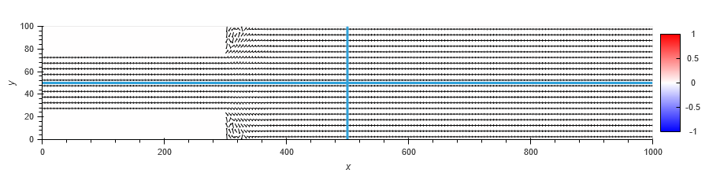
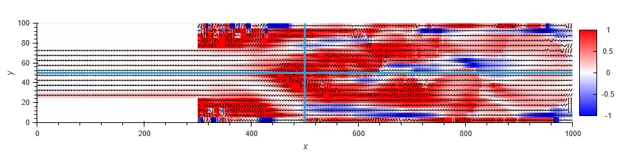

# Bed-variation-of-suddenly-enlarged-open-channel
simulate Bed variation of suddenly enlarged open channel using Depth Averaged 2D Bed Variation model 

 - initial 

 - after 500 hours

[time series](https://computational-sediment-hyd.github.io/Bed-variation-of-suddenly-enlarged-open-channel/out.html)